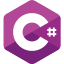
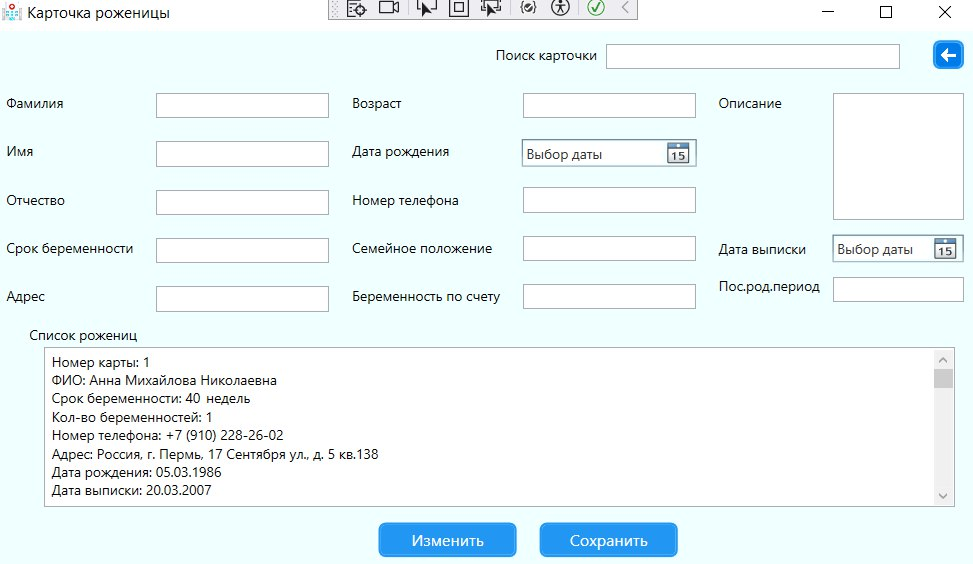
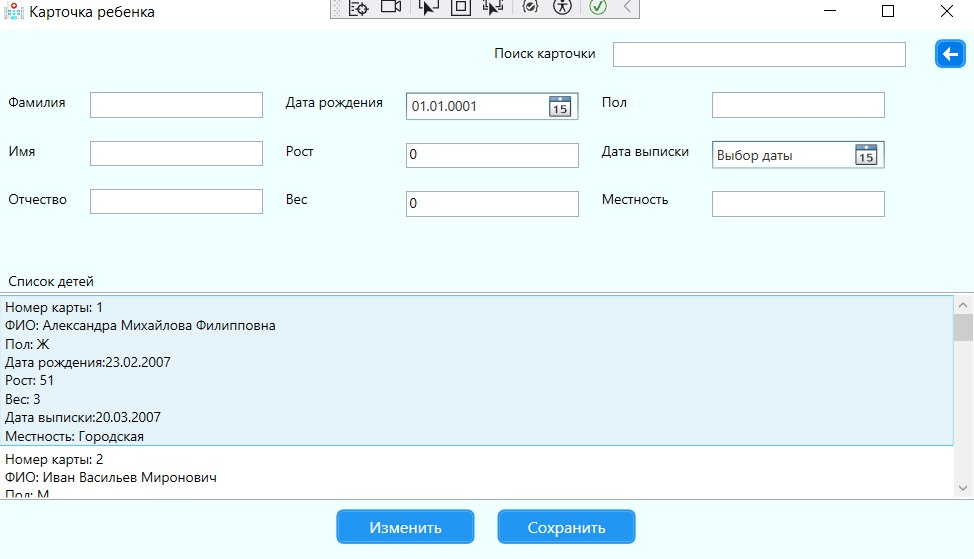
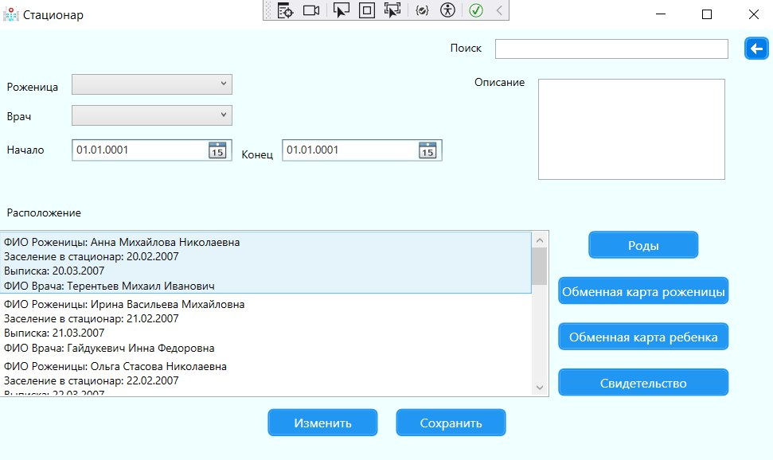
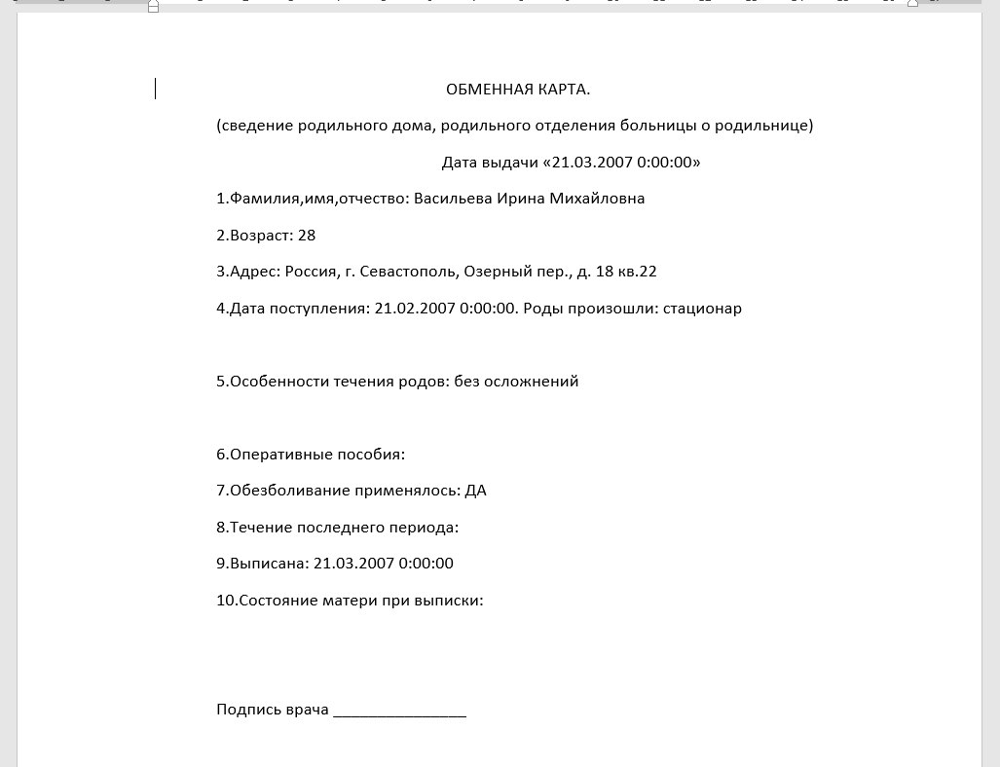
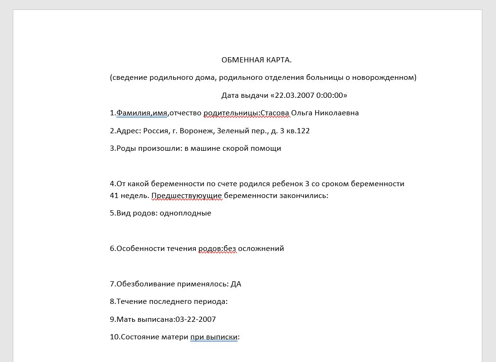

<!-- Improved compatibility of back to top link: See: https://github.com/othneildrew/Best-README-Template/pull/73 -->

<!--
*** Thanks for checking out the Best-README-Template. If you have a suggestion
*** that would make this better, please fork the repo and create a pull request
*** or simply open an issue with the tag "enhancement".
*** Don't forget to give the project a star!
*** Thanks again! Now go create something AMAZING! :D
-->

<!-- PROJECT SHIELDS -->
<!--
*** I'm using markdown "reference style" links for readability.
*** Reference links are enclosed in brackets [ ] instead of parentheses ( ).
*** See the bottom of this document for the declaration of the reference variables
*** for contributors-url, forks-url, etc. This is an optional, concise syntax you may use.
*** https://www.markdownguide.org/basic-syntax/#reference-style-links
-->

<!-- PROJECT LOGO -->
 

  
<h1>
    РОДМЕД
  </h1>
  

    Проект представляет собой АИС врачей и медсестер роддома.
  

  

    Возможности системы:    
  

  <ol>
    <li>Ведение учета медицинских карточек роженицы</li>
    <li>Ведение учета родов и новорожденных</li>
    <li>Формирование отчетов по обменным картам и медицинским свидетельствам</li>
  </ol>

<!-- TABLE OF CONTENTS -->

  
Table of Contents

  <ol>
    <li>
      <a href="#about-the-project">About The Project</a>
      <ul>
        <li><a href="#built-with">Built With</a></li>
      </ul>
    </li>
    <li>
      <a href="#getting-started">Getting Started</a>
      <ul>
        <li><a href="#prerequisites">Prerequisites</a></li>
        <li><a href="#installation">Installation</a></li>
      </ul>
    </li>
    <li><a href="#usage">Usage</a></li>
    <li><a href="#roadmap">Roadmap</a></li>
    <li><a href="#contributing">Contributing</a></li>
    <li><a href="#license">License</a></li>
    <li><a href="#contact">Contact</a></li>
    <li><a href="#acknowledgments">Acknowledgments</a></li>
  </ol>

### Создано с

 

(<a href="#readme-top">Наверх</a>)

<!-- GETTING STARTED -->
## Начало работы

Для установки скачайте необходимую версию с [https://github.com/Oleg213456/APP]

<!-- USAGE EXAMPLES -->
## Использование

Приложение позволяет отслеживать хранимые в карточке роженицы, карточке ребёнка и сведеньях о стационаре, которые при необходимости могут быть добавлены/изменены.

В системе есть функция вывода на печать обменных карт роженицы и ребёнка

(<a href="#readme-top">Наверх</a>)

<!-- CONTRIBUTING -->
## Вклад

Вклад - это то, что делает сообщество с открытым исходным кодом таким замечательным местом для обучения, вдохновения и творчества. Мы очень ценим любой ваш вклад.

Если у вас есть предложения, которые могли бы улучшить это, пожалуйста, разветвляйте репозиторий и создайте запрос на извлечение. Вы также можете просто открыть проблему с тегом "улучшение". Не забудьте поставить проекту звездочку! Еще раз спасибо!

1. Разветвляем проект
2. Создайте свою функциональную ветку (`git checkout -b feature/AmazingFeature`)
3. Зафиксируйте внесенные изменения (`git commit -m 'Add some AmazingFeature'`)
4. Отправить в ветку (`git push origin feature/AmazingFeature`)
5. Открыть запрос на извлечение

(<a href="#readme-top">Наверх</a>)

<!-- LICENSE -->
## Лицензия

Распространяется по лицензии MIT. Смотрите `LICENSE.txt` для получения дополнительной информации.

(<a href="#readme-top">Наверх</a>)

<!-- CONTACT -->
## Контакты

Почта для связи - danya.akimov.03@gmail.com

Ссылка на проект: [https://github.com/Oleg213456/APP)

(<a href="#readme-top">Наверх</a>)

<!-- MARKDOWN LINKS & IMAGES -->
<!-- https://www.markdownguide.org/basic-syntax/#reference-style-links -->
[sharplogo]: Images/free-icon-c-sharp-6132221.png
[sharp-url]: https://learn.microsoft.com/ru-ru/dotnet/csharp/
[mssqllogo]: Images/free-icon-sql-server-5968554.png
[mssql-url]: https://www.microsoft.com/ru-ru/sql-server/
[parturient]: Images/photo_5411252188862338911_y.jpg
[kid]: Images/photo_5411252188862338913_y.jpg
[inpatient]: Images/photo_5411252188862338912_y.jpg
[exchange-card-of-parturient]: Images/photo_5411252188862338914_y.jpg
[exchange-card-of-kid]: Images/photo_5411252188862338915_y.jpg
